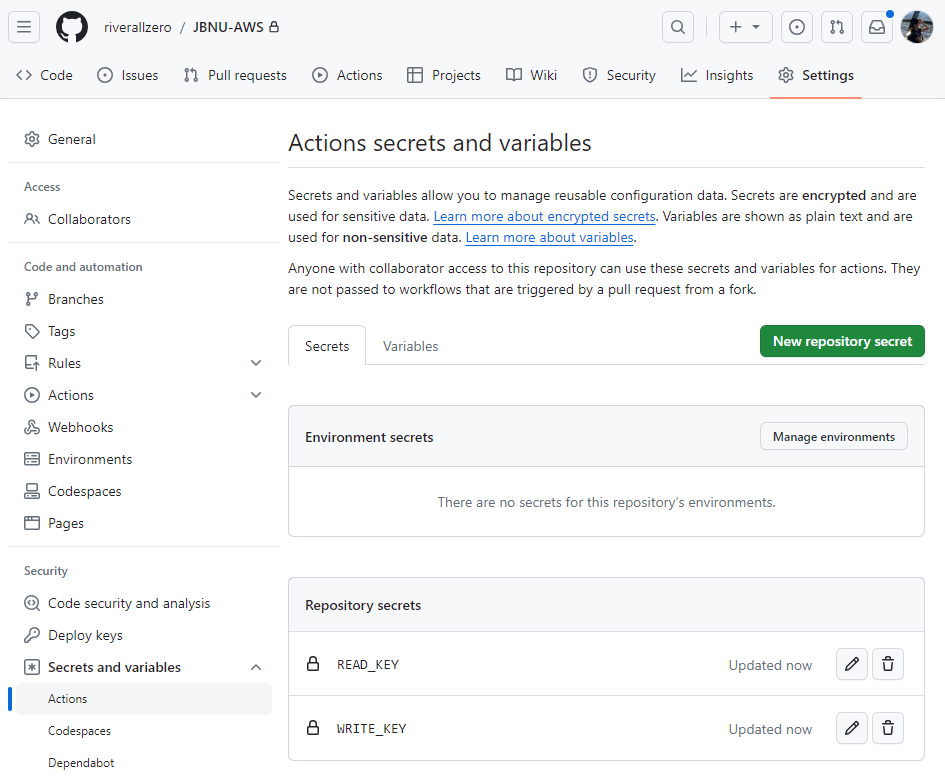

# JBNU-AWS

## Setting
### ThingSpeak

⚙︎ Repository Settings - (Security) Secrets and variables - Actions - New repository secret으로 생성
- WRITE_KEY
- READ_KEY 

⚙︎ Settings - Developer settings - Personal access tokens - Token(classic) - Generate new token으로 생성
- TOKEN

Secret 설정하기

Channel 만들기

- field 생성
- github 링크 첨부

API 가져오기

