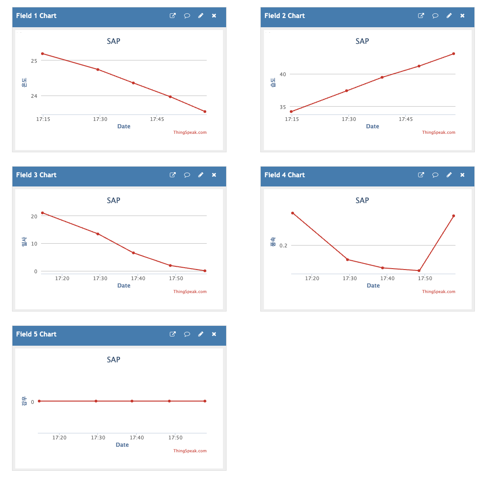
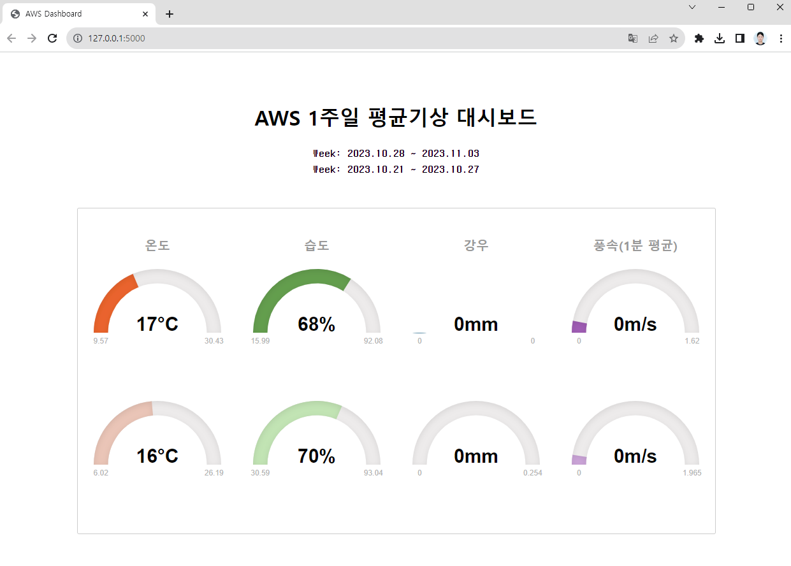
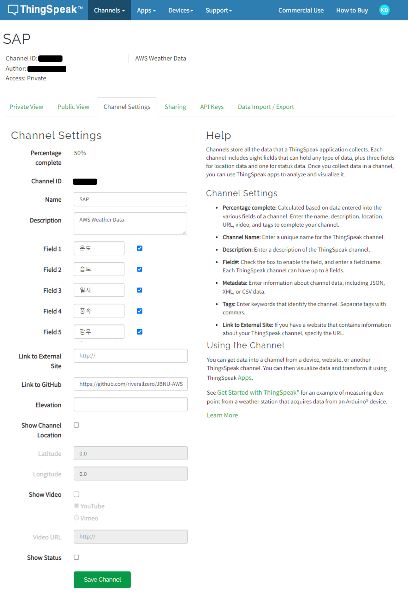
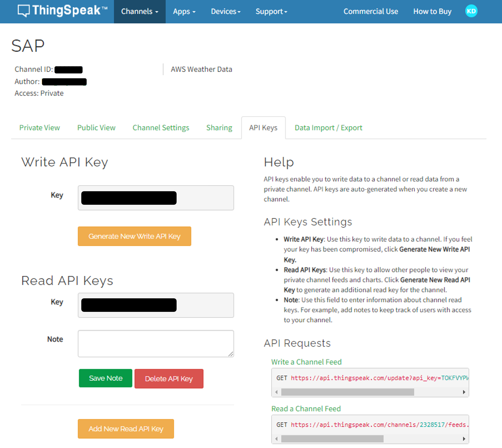
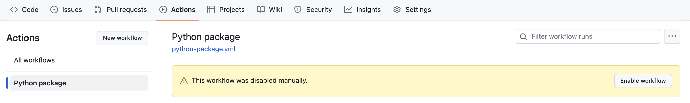

# JBNU-AWS

## Current Data
| 날짜 | 시간 | 온도 | 습도 | 일사 | 풍속(1분평균) | 강우 |
| --- | --- | --- | --- | --- | --- | --- |
| 2023-11-02 | 17:57:40 | 23.54 | 43.1 | 0.0 | 0.36 | 0 |

## Description
- 10분마다 AWS에서 기상 데이터를 수집후 ThingSpeak에 업로드
- ThingSpeak에 실시간으로 업로드 된 데이터를 위 [**Current Data**](https://github.com/riverallzero/JBNU-AWS#current-data)에 테이블 형태로 입력
    - Github Action workflow 이용
    - 아래 [**Setting**](https://github.com/riverallzero/JBNU-AWS#thingspeak) 참조

<div align="center" style="display:flex;"> 
    
</div>

- 1주일 평균 기상데이터와 1주일 이전 평균 기상데이터 비교 대시보드
  - ```python app.py``` 실행
  - ```http://127.0.0.1:5000``` 연결
    
||
---|

## Setting
### Cron
```
schedule:
- cron:  "*/10 * * * *"
```

### Repository
⚙︎ Repository Settings - (Security) Secrets and variables - Actions - New repository secret으로 생성
- WRITE_KEY: thingspeak write api key 입력
- READ_KEY: thingspeak read api key 입력

### ThingSpeak
<details>
<summary>Channel 만들기</summary>

- field 생성
- github 링크 첨부


</details>

<details>
<summary>API 가져오기</summary>


</details>

### Workflow
Enable workflow로 활성화


